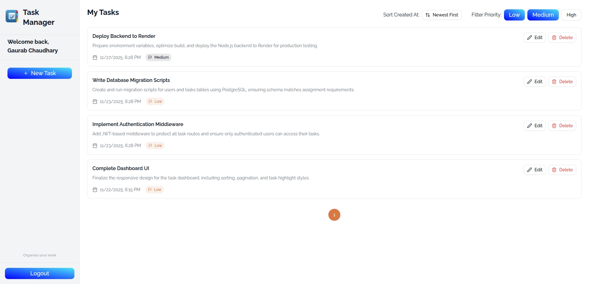
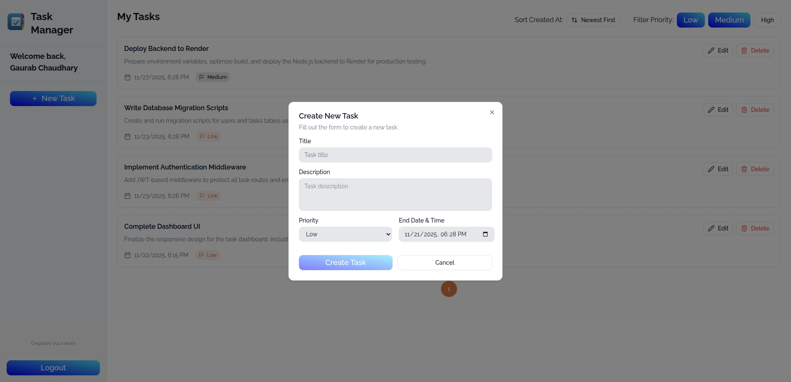

# Task Manager Dashboard - Frontend

A modern, responsive task management application built with **Next.js 16**, **TypeScript**, **Redux Toolkit**, and **TailwindCSS**. Features secure JWT authentication, real-time task management, and a beautiful UI with dark/light theme support.

## Backend

[Task Manager Backend](https://github.com/GaurabGogo/gaurab-chaudhary-task-management-backend)

---

## 🚀 Features

- ✅ **User Authentication** - JWT-based login/registration with HTTP-only cookies
- 📋 **Task Management** - Create, read, update, and delete tasks
- 🎨 **Visual Indicators** - Highlight overdue tasks
- 🔍 **Sorting & Filtering** - Sort by date/priority with pagination
- 📱 **Responsive Design** - Works on mobile, tablet, and desktop
- ⚡ **Modern UI** - Built with Radix UI and shadcn/ui components

---

## 🛠️ Tech Stack

| Category             | Technologies                                 |
| -------------------- | -------------------------------------------- |
| **Framework**        | Next.js 16 (App Router)                      |
| **Language**         | TypeScript 5                                 |
| **Styling**          | TailwindCSS 4, SASS                          |
| **State Management** | Redux Toolkit, Redux Persist, TanStack Query |
| **UI Components**    | Radix UI, shadcn/ui, Lucide React            |
| **Form Handling**    | React Hook Form, Zod validation              |
| **HTTP Client**      | Axios                                        |
| **Date Handling**    | date-fns, Luxon                              |
| **Code Quality**     | ESLint, Prettier                             |

---

## 📁 Project Structure

```
gaurab-chaudhary-frontend/
├── src/
│   ├── app/                    # Next.js App Router
│   │   ├── (auth)/            # Authentication routes (login, signup)
│   │   ├── (main)/            # Main application routes (dashboard)
│   │   └── layout.tsx         # Root layout
│   ├── components/            # Reusable UI components
│   ├── redux/                # Redux store & slices
│   ├── services/             # API services
│   ├── models/               # TypeScript interfaces
│   ├── hooks/                # Custom React hooks
│   └── utils/                # Utility functions
├── public/                   # Static assets
└── package.json              # Dependencies
```

---

## 🔧 Setup Instructions

### Prerequisites

- **Node.js** 20.x or higher
- **pnpm** (recommended) or npm/yarn

### Installation

1. **Clone the repository**

   ```bash
   git clone https://github.com/GaurabGogo/gaurab-chaudhary-task-management-frontend.git
   cd gaurab-chaudhary-task-management-frontend
   ```

2. **Install dependencies**

   ```bash
   pnpm install
   # or
   npm install
   ```

3. **Environment Configuration**

   Create a `.env` file in the root directory:

   ```env
   NEXT_PUBLIC_API_URL=http://localhost:8000/api/v1
   ```

   > **Note**: Update `NEXT_PUBLIC_API_URL` to point to your backend API URL.

4. **Run the development server**

   ```bash
   pnpm dev
   # or
   npm run dev
   ```

5. **Open your browser**

   Navigate to [http://localhost:3000](http://localhost:3000)

---

## 📜 Available Scripts

| Command      | Description                                         |
| ------------ | --------------------------------------------------- |
| `pnpm dev`   | Start development server on `http://localhost:3000` |
| `pnpm build` | Build production-ready application                  |
| `pnpm start` | Start production server (requires build first)      |
| `pnpm lint`  | Run ESLint to check code quality                    |

---

## 🔐 Authentication

### Token Storage Strategy

This application uses **HTTP-only cookies** for storing JWT tokens:

**Why HTTP-only cookies over localStorage?**

- ✅ Protection against XSS attacks (JavaScript cannot access cookies)
- ✅ Automatic inclusion in requests
- ✅ Secure flag in production (HTTPS only)

### Features

- Automatic token refresh on expiry
- Seamless retry of failed requests
- Automatic redirect to login when unauthorized

---

## Preview





## 🚀 Deployment

### Vercel (Recommended)

1. Push your code to GitHub
2. Import project in [Vercel](https://vercel.com)
3. Add environment variable: `NEXT_PUBLIC_API_URL`
4. Deploy

```bash
# Or use Vercel CLI
pnpm install -g vercel
vercel
```

### Netlify

1. Build: `pnpm build`
2. Deploy the `.next` folder
3. Add environment variables in Netlify dashboard

### Environment Variables for Production

```env
NEXT_PUBLIC_API_URL=https://your-backend-api.com/api
```

---

## 🧪 Testing Checklist

- [ ] User registration and login
- [ ] Token refresh on session expiry
- [ ] Create, edit, and delete tasks
- [ ] Sort tasks by date and priority
- [ ] Pagination navigation
- [ ] Overdue task highlighting

---

## 📝 Code Quality

- **ESLint** - Next.js recommended rules with TypeScript strict mode
- **Prettier** - Automatic code formatting with TailwindCSS class sorting
- **TypeScript** - Full type safety across the application

---

## 👨‍💻 Author

**xGogo**

---

## 🙏 Acknowledgments

- [Next.js Documentation](https://nextjs.org/docs)
- [shadcn/ui](https://ui.shadcn.com/)
- [Radix UI](https://www.radix-ui.com/)
- [TailwindCSS](https://tailwindcss.com/)
- [Redux Toolkit](https://redux-toolkit.js.org/)

---

**Built with ❤️ using Next.js and TypeScript**
